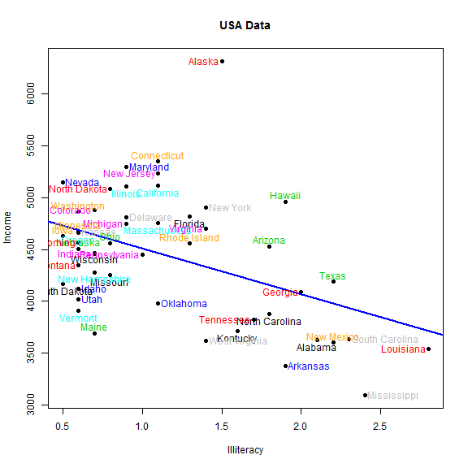

USA Data, Shiny app
========================================================
author: MS
date: February 4, 2017
autosize: true
transition: rotate
transition-speed: fast

About
========================================================

This is a Pitch Presentation for a USA Data Shiny app. It is a Coursera project for a course Developing Data Products (9<sup>th</sup> course of Data Science Specialization) .

The Shiny app is avaliable at: <https://dieleitter.shinyapps.io/usa_data/>

The code for the ui. R and server.R is avaliable at Github: <https://github.com/DieLeitter/ShinyApp_USData> 


Introduction
========================================================
* Wondering if there is correlation between income and education?  
* Does Us states with high Education level have lower murder rate?
* Does the average frost number of days correlate with population? 
* Does the life expextancy collerate with people illiteracy?

<br>
<br>

<span style="font-weight:bold; font-size: 34pt;">You can stop wonering and get some solid numbers</span>


USA Data Shiny App
========================================================

This shiny app generates scatter plots between two chosen variables and fit a linear regression. 
The varaibles are selected form state.x77 dataset (more info about data set here <https://stat.ethz.ch/R-manual/R-devel/library/datasets/html/state.html>). One can choose between 8 features: 
Population, Income, Illiteracy, Life Exp., Murder, HS Grad, Frost, and Area.

To get started:
* Select desired x and y from the input boxes. 
* Brush the plot to select points for which you would like to fit regression line, which will be seen as a blue line in the plot. Note: at least two points needs to be selected to fit a regression line.
* Zoom in can be done by selecting and area (brushing) an double clicking.


========================================================
left: 35%

Scatterplot example


***

Few lines of the state.x77 dataset:

```r
state.x77[1:3, 1:5]
```

```
        Population Income Illiteracy Life Exp Murder
Alabama       3615   3624        2.1    69.05   15.1
Alaska         365   6315        1.5    69.31   11.3
Arizona       2212   4530        1.8    70.55    7.8
```
<br>
<br>
<br>
<br>
Caution:
<span style="font-weight:bold; color:red;">Correlation is not causation.</span>

